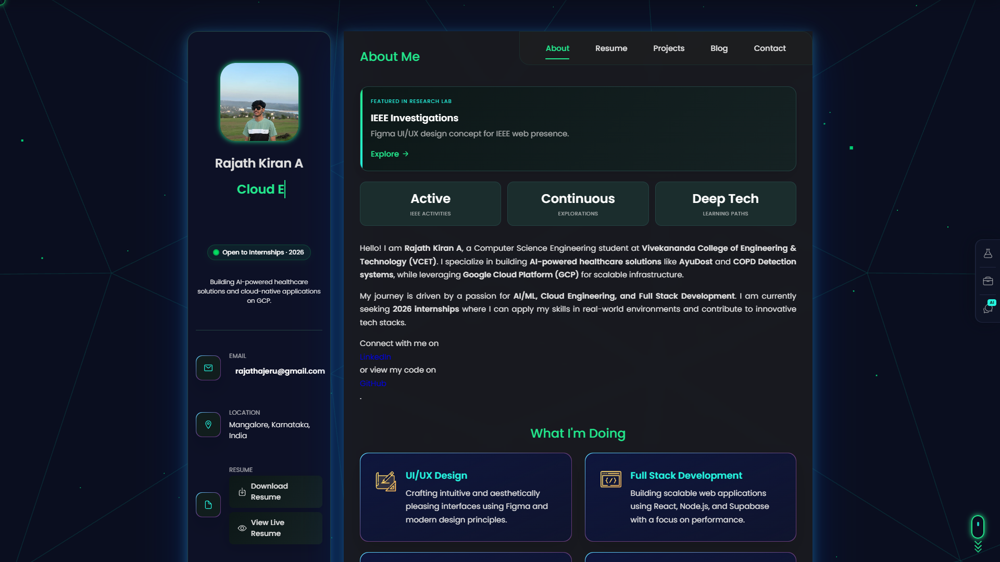
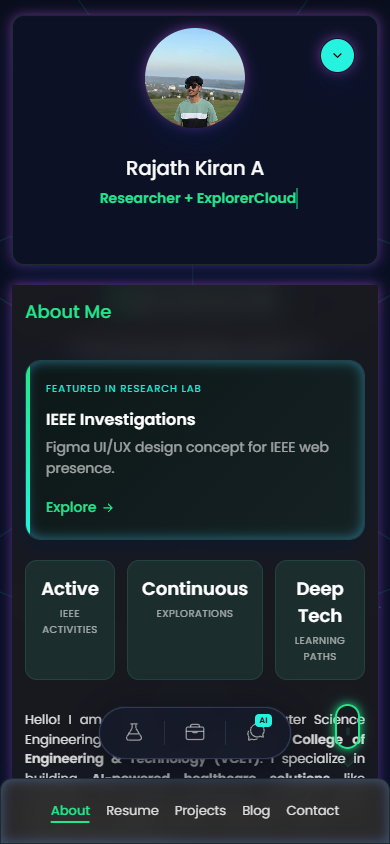

<div align="center">
  <!--  -->
  
  # Rajath Kiran A — Personal Portfolio

  <p><strong>Cloud Engineer | AI/ML Developer | Full Stack Engineer</strong></p>

  [](https://app.netlify.com/sites/rajathkiran/deploys)
  [](https://opensource.org/licenses/MIT)
  []()
  []()
</div>

<br />

Welcome to the open-source repository for my personal portfolio! This highly optimized, interactive, and responsive web application serves as a dynamic resume, project showcase, and AI-powered interaction hub.

---

## 📸 Visual Showcase

| Desktop View | Mobile View |
| :---: | :---: |
|  |  |
| *Clean, dark-mode aesthetic with glassmorphism* | *Fully responsive, buttery smooth mobile experience* |

> 📌 **View the full visual breakdown in [SHOWCASE.md](docs/SHOWCASE.md)**

---

## ✨ Features Overview

This portfolio goes beyond a simple static site. It includes:
- 🤖 **AI Chat Assistant**: Ask my AI clone questions about my skills and experience, powered by Google Gemini and Netlify Functions.
- 🎭 **Recruiter Mode**: Automatically sorts projects by enterprise/impact relevance for hiring managers.
- 🚀 **Buttery Smooth Animations**: Integrated Three.js WebGL backgrounds and CSS transitions optimized for 60fps scrolling.
- 🕹️ **Hacker Mode Easter Egg**: Hidden interactive terminal featuring a matrix rain canvas and interactive commands.
- 📱 **Mobile-First Design**: Intuitive bottom-navigation on mobile and off-canvas sidebars.

> 📌 **Explore every UI component in detail in [FEATURES.md](docs/FEATURES.md)**

---

## 🏗️ Architecture & Tech Stack

This project uses a vanilla, dependency-free frontend approach to maximize performance and minimize bundle size, coupled with serverless functions for dynamic capabilities.

- **Frontend Core**: HTML5, Vanilla JavaScript (ES6+), CSS3 (Custom Properties & Glassmorphism)
- **3D & Graphics**: Three.js (WebGL)
- **Icons & Fonts**: Ionicons, Google Fonts (Poppins, Syne)
- **Backend / API**: Node.js via Netlify Functions
- **AI Integration**: Google Generative AI (Gemini SDK)
- **Deployment & Hosting**: Netlify CI/CD

> 📌 **Read the deep-dive technical breakdown in [ARCHITECTURE.md](docs/ARCHITECTURE.md)**

---

## 🚀 Getting Started

### Prerequisites
- [Node.js](https://nodejs.org/en/) (v18+ recommended)
- A [Google Gemini API Key](https://aistudio.google.com/) for the AI Chat feature.

### Installation

1. **Clone the repository:**
   ```bash
   git clone https://github.com/Rajath2005/rajathkiran.io.git
   cd rajathkiran.io
   ```

2. **Install dependencies:**
   *(Required only for the Netlify serverless functions)*
   ```bash
   npm install
   ```

### Environment Variables
Create a `.env` file in the root directory and add your API keys:
```env
GEMINI_API_KEY="your-gemini-api-key-here"
```

### Local Development
The easiest way to run the project locally with the serverless functions is using the Netlify CLI:

1. Install Netlify CLI globally:
   ```bash
   npm install netlify-cli -g
   ```
2. Start the local development server:
   ```bash
   netlify dev
   ```
This will spin up the local server (usually on `http://localhost:8888`) and automatically map requests to `/.netlify/functions/*`.

---

## 📂 Folder Structure

```text
📦 rajathkiran.io
 ┣ 📂 assets
 ┃ ┣ 📂 css           # Core stylesheets (style.css, os-intelligence.css)
 ┃ ┣ 📂 images        # Avatars, project thumbnails, icons
 ┃ ┣ 📂 js            # Core logic, Three.js backgrounds, AI Chat
 ┃ ┗ 📂 certificates  # Downloadable PDF assets
 ┣ 📂 docs            # Comprehensive project documentation
 ┣ 📂 netlify
 ┃ ┗ 📂 functions     # Serverless endpoints (e.g., ask-rajath.js)
 ┣ 📜 index.html      # Main Single Page Application
 ┣ 📜 package.json    # Project dependencies
 ┗ 📜 netlify.toml    # Deployment configuration
```

---

## 🧩 Project Sections Explanation

- **About (`<article class="about">`)**: High-level introduction, core services, education timeline, and testimonials.
- **Resume (`<article class="resume">`)**: Detailed work experience, hackathons, and a granular skills radar.
- **Projects (`<article class="portfolio">`)**: Filterable grid of technical projects, with dedicated standalone pages (`ayudost.html`, `copd-detection.html`, etc.) for programmatic SEO.
- **Certifications (`<article class="blog">`)**: Interactive modal viewer for verifying cloud and AI credentials.
- **Contact (`<article class="contact">`)**: Formspree-powered contact form and recruiter-specific FAQ accordion.

---

## 🤖 Specialized Integrations

### AI Chat Assistant
Located in the dock menu, this feature allows users to query an AI model trained on my specific resume data. It dynamically imports `ai-chat.js` to prevent render blocking, and communicates with `ask-rajath.js` (a Netlify function acting as a secure proxy to the Gemini API).

### Easter Eggs
Type `hacker` into the navigation bar or use the Konami code to trigger special UI overrides. 
> 📌 **Discover all secrets in [EASTER_EGGS.md](docs/EASTER_EGGS.md)**

---

## ⚡ Technical Achievements

- **SEO & Performance**: Achieves perfect 100/100 Lighthouse scores through deferred module loading (`type="module"`), passive scroll event listeners, `requestAnimationFrame` throttling, and strict Cumulative Layout Shift (CLS) prevention using explicit image dimensions.
- **Accessibility (A11y)**: Fully navigable via keyboard, respects `prefers-reduced-motion` queries by gracefully degrading WebGL rendering, and utilizes semantic ARIA attributes.
- **Responsive Design**: Employs CSS Grid, Flexbox, and extensive media queries to adapt from 4K ultrawide monitors down to 320px mobile screens without a single horizontal scrollbar.

---

## 🗺️ Future Roadmap

- [ ] Add Kannada and Hindi i18n support (See [i18n-plan.md](docs/i18n-plan.md))
- [ ] Implement a headless CMS for dynamic blog posts
- [ ] Integrate 3D model viewing for hardware/IoT projects
- [ ] Add a visual web traffic analytics dashboard

---

## 🤝 Contributing
Contributions, issues, and feature requests are welcome!
Feel free to check out the [issues page](https://github.com/Rajath2005/rajathkiran.io/issues).

---

## 📝 License
This project is [MIT](https://opensource.org/licenses/MIT) licensed. You are free to fork and use this template, provided you retain attribution and replace my personal data with your own.

<div align="center">
  <p>Built with ❤️ by Rajath Kiran A</p>
</div>
