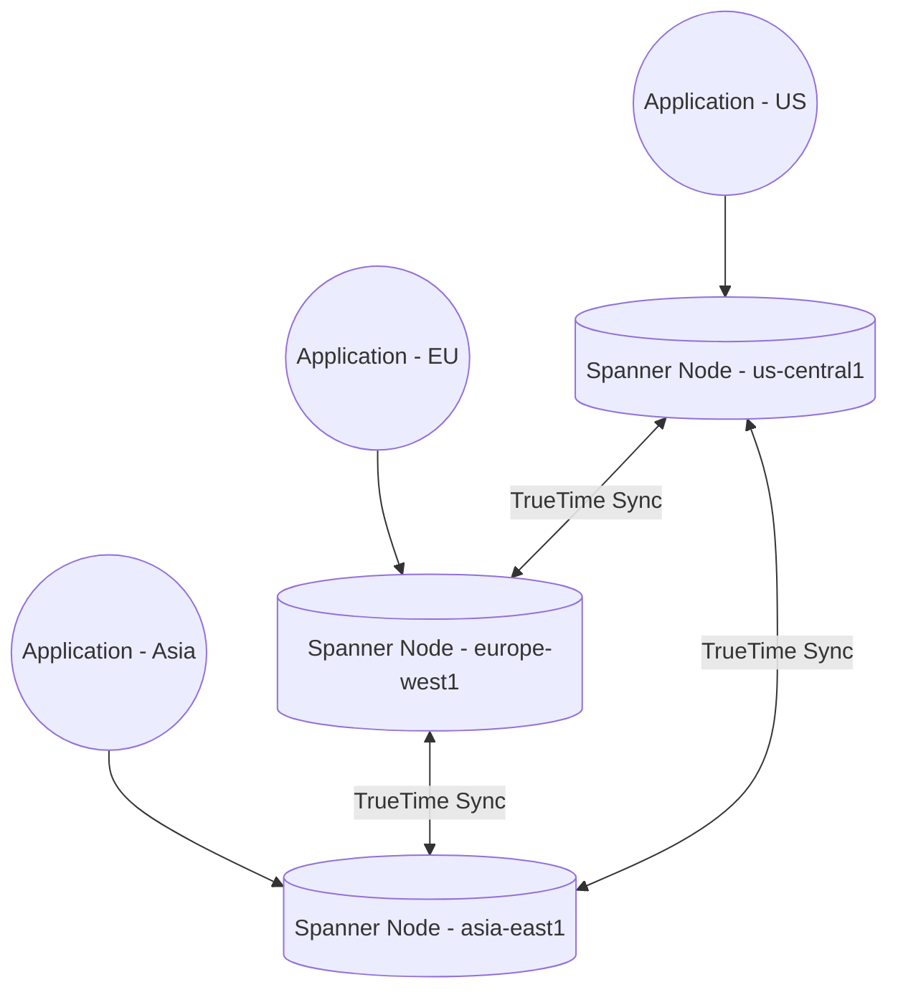

# Cloud Repository Build Pack: GCP-Distributed-Spanner

## 1. Repository Description
A globally distributed database architecture utilizing Google Cloud Spanner. This project demonstrates horizontally scalable relational data handling, strong global consistency, and multi-region deployment configurations for enterprise financial or inventory systems.

## 2. Repository Topics / Tags
`gcp`, `cloud-spanner`, `distributed-database`, `sql`, `high-availability`, `horizontal-scaling`, `new-sql`

## 3. Production README.md
```markdown
# Globally Distributed Database with Cloud Spanner

## Overview
This repository contains the database schemas, deployment scripts, and performance testing configurations for a globally distributed relational database using Google Cloud Spanner. Spanner provides the rare combination of relational structure (SQL) with horizontal scalability and strong global consistency.

## Architecture Highlights
- **Multi-Region Deployment:** Configured to span multiple GCP regions to ensure survival of a regional failure.
- **Strong Consistency:** Guarantees zero data loss (RPO=0) and strongly consistent reads globally using TrueTime.
- **Schema Optimization:** Uses interleaved tables to co-locate parent and child records on the same storage node for extremely fast joins.

## Deployment Instructions
Follow the instructions to provision the Spanner instance, apply the DDL schemas, and run the Python simulation script to insert and query data.
```

## 4. Mermaid Architecture Diagram


## 5. Folder Structure
```
/GCP-Distributed-Spanner
├── README.md
├── architecture-diagram.png
└── database/
    ├── schema.ddl
    └── load_test.py
```

## 6. Screenshot Checklist
- [ ] Cloud Spanner instance dashboard showing node topology.
- [ ] Query execution plan displaying interleaved table scan efficiency.
- [ ] Monitoring graph showing read/write throughput during load testing.

## 7. Implementation Steps
1. **Provision Instance:** Create a Cloud Spanner instance. Select a multi-region configuration for maximum availability.
2. **Apply Schema:** Create a database and execute the `schema.ddl` to generate parent and interleaved child tables.
3. **Data Generation:** Write a Python script using the Spanner client library to generate and insert thousands of mock transaction records via mutations.
4. **Load Testing:** Execute heavy read/write queries and observe the scaling capabilities in the Spanner monitoring dashboard.

## 8. Skills Demonstrated
- Cloud Spanner Architecture (TrueTime, Split boundaries)
- Advanced SQL (Interleaved tables)
- Global database distribution
- Python Client Libraries

## 9. Resume Bullet Points
- Architected a globally distributed relational database using Google Cloud Spanner, achieving 99.999% availability and strong consistency across multiple geographic regions.
- Optimized database schemas using interleaved tables to co-locate parent-child data, significantly improving query performance and reducing latency for complex joins.

## 10. Interview Talking Points
- **Why Spanner over Cloud SQL?** Cloud SQL is vertical scaling only. Spanner provides horizontal scaling across thousands of nodes while retaining SQL semantics.
- **What is TrueTime?** It's GCP's highly synchronized global clock system that allows Spanner to assign globally consistent timestamps to transactions, enabling strong consistency without locking up the database.
- **Interleaved Tables:** A unique Spanner feature where child rows are physically stored directly adjacent to their parent row in the underlying distributed file system (Colossus).

## 11. Repository Creation Checklist
- [ ] Create GitHub Repository.
- [ ] Upload DDL schema and Python scripts.
- [ ] Generate and upload `architecture-diagram.png`.
- [ ] Add the Production README.

## 12. Starter File Contents

### `database/schema.ddl`
```sql
CREATE TABLE Singers (
  SingerId   INT64 NOT NULL,
  FirstName  STRING(1024),
  LastName   STRING(1024),
  SingerInfo BYTES(MAX)
) PRIMARY KEY (SingerId);

CREATE TABLE Albums (
  SingerId     INT64 NOT NULL,
  AlbumId      INT64 NOT NULL,
  AlbumTitle   STRING(MAX)
) PRIMARY KEY (SingerId, AlbumId),
  INTERLEAVE IN PARENT Singers ON DELETE CASCADE;
```

### `database/load_test.py`
```python
from google.cloud import spanner
import uuid

# Initialize client
spanner_client = spanner.Client()
instance = spanner_client.instance("my-spanner-instance")
database = instance.database("my-database")

def insert_data(transaction):
    singer_id = int(uuid.uuid4().int & (1<<63)-1) # Random INT64
    
    transaction.insert(
        "Singers",
        columns=("SingerId", "FirstName", "LastName"),
        values=[(singer_id, "John", "Doe")]
    )
    
    transaction.insert(
        "Albums",
        columns=("SingerId", "AlbumId", "AlbumTitle"),
        values=[(singer_id, 1, "First Album"), (singer_id, 2, "Second Album")]
    )

print("Starting transaction...")
database.run_in_transaction(insert_data)
print("Transaction committed.")
```
