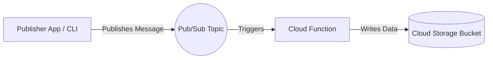

# Cloud Repository Build Pack: GCP-Event-Driven-PubSub

## 1. Repository Description
An asynchronous, event-driven data pipeline using Google Cloud Pub/Sub, Cloud Functions, and Cloud Storage. This repository demonstrates how to decouple services and process high-throughput data streams in real-time.

## 2. Repository Topics / Tags
`gcp`, `pubsub`, `cloud-functions`, `event-driven-architecture`, `serverless`, `python`, `data-pipeline`

## 3. Production README.md
```markdown
# Event-Driven Architecture with GCP Pub/Sub

## Overview
This repository implements a serverless event-driven architecture. Messages are published to a Google Cloud Pub/Sub topic which triggers a Python Cloud Function to process the payload and securely store the output into a Google Cloud Storage bucket. This pattern is highly scalable and completely abstracts infrastructure management.

## Architecture Highlights
- **Messaging:** Cloud Pub/Sub guarantees at-least-once message delivery.
- **Compute:** Cloud Functions (2nd Gen) automatically scales to zero or thousands of instances based on event volume.
- **Storage:** Processed data is stored redundantly in a Cloud Storage bucket.

## Deployment Instructions
Follow the steps below using the `gcloud` CLI to provision the Topic, deploy the Function, and publish test messages.
```

## 4. Mermaid Architecture Diagram


## 5. Folder Structure
```
/GCP-Event-Driven-PubSub
├── README.md
├── architecture-diagram.png
└── src/
    ├── publisher.py
    ├── main.py
    └── requirements.txt
```

## 6. Screenshot Checklist
- [ ] Pub/Sub topic dashboard showing message throughput.
- [ ] Cloud Function logs showing successful execution and parsed data.
- [ ] Cloud Storage bucket displaying generated output files.

## 7. Implementation Steps
1. **Pub/Sub Setup:** Create a Pub/Sub topic named `data-ingestion-topic`.
2. **Storage Setup:** Create a Cloud Storage bucket named `processed-data-bucket`.
3. **Write Function Code:** Implement a Cloud Function in Python that takes the Pub/Sub event payload, parses it, and writes a `.json` file to the Storage bucket.
4. **Deploy Function:** Deploy the Cloud Function with an event trigger tied to `data-ingestion-topic`.
5. **Test Pipeline:** Run the Python publisher script to simulate sending 100 events asynchronously.

## 8. Skills Demonstrated
- Cloud Pub/Sub (Topics, Subscriptions)
- Serverless Compute (Cloud Functions)
- Event-driven patterns
- Asynchronous Python programming

## 9. Resume Bullet Points
- Designed a serverless event-driven data pipeline utilizing Google Cloud Pub/Sub and Cloud Functions to process asynchronous data streams in real-time.
- Decoupled application components, enabling the architecture to handle unpredictable traffic spikes while scaling compute resources dynamically and cost-effectively.

## 10. Interview Talking Points
- **Why Pub/Sub over direct HTTP calls?** Decoupling. If the Cloud Function crashes or is overwhelmed, Pub/Sub retains the message and retries, preventing data loss.
- **Cloud Functions vs Cloud Run:** Used Cloud Functions because the logic is simple and strictly triggered by GCP native events.
- **Idempotency:** Cloud Functions must be written idempotently since Pub/Sub guarantees at-least-once delivery (meaning duplicates can occur).

## 11. Repository Creation Checklist
- [ ] Create GitHub Repository.
- [ ] Upload Cloud Function source code.
- [ ] Generate and upload `architecture-diagram.png` using Mermaid.
- [ ] Add the Production README.

## 12. Starter File Contents

### `src/publisher.py`
```python
import os
import time
from google.cloud import pubsub_v1

project_id = "YOUR_PROJECT_ID"
topic_id = "data-ingestion-topic"

publisher = pubsub_v1.PublisherClient()
topic_path = publisher.topic_path(project_id, topic_id)

for i in range(1, 10):
    data = f"Simulated Event Data ID: {i}"
    data_bytes = data.encode("utf-8")
    
    future = publisher.publish(topic_path, data=data_bytes)
    print(f"Published message ID: {future.result()}")
    time.sleep(1)
```

### `src/main.py` (Cloud Function)
```python
import base64
import json
from google.cloud import storage

def process_event(event, context):
    """Triggered from a message on a Cloud Pub/Sub topic."""
    
    if 'data' in event:
        payload = base64.b64decode(event['data']).decode('utf-8')
        print(f"Received payload: {payload}")
        
        # Save to Cloud Storage
        storage_client = storage.Client()
        bucket = storage_client.bucket("processed-data-bucket")
        blob = bucket.blob(f"event_{context.event_id}.json")
        
        data = {
            "event_id": context.event_id,
            "timestamp": context.timestamp,
            "payload": payload
        }
        
        blob.upload_from_string(json.dumps(data))
        print("Successfully written to Cloud Storage.")
    else:
        print("No data in event.")
```
