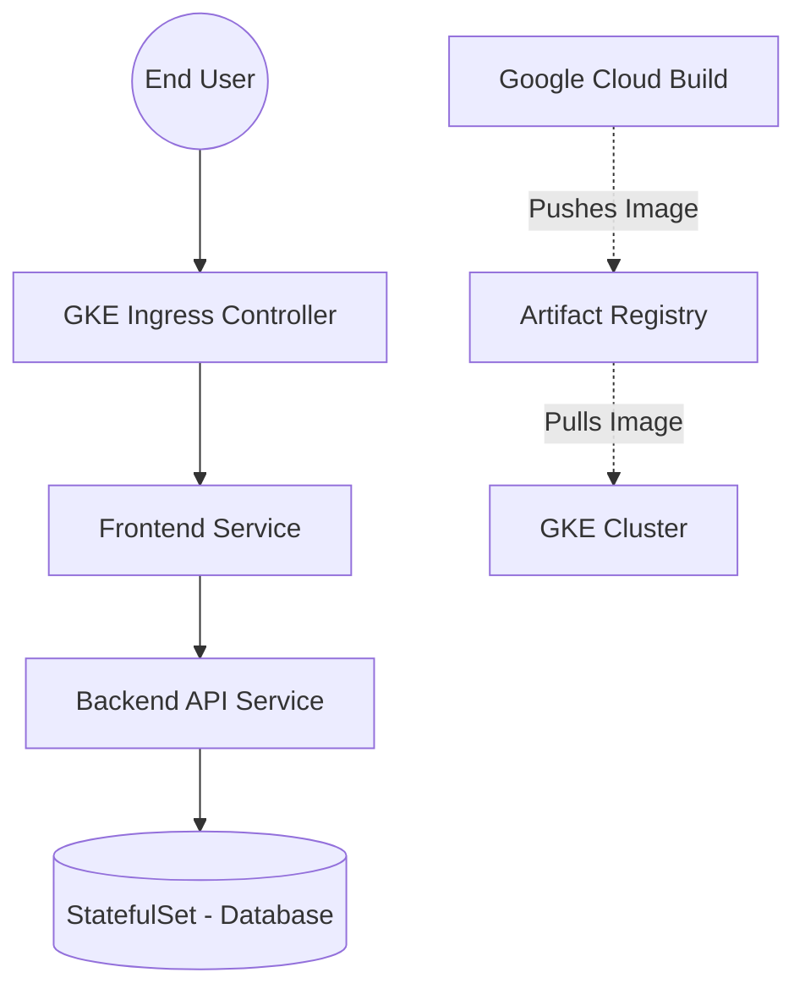

# Cloud Repository Build Pack: GCP-GKE-Microservices

## 1. Repository Description
A scalable, containerized microservices application deployed on Google Kubernetes Engine (GKE). This repository showcases best practices for Kubernetes deployment, inter-service communication, and automated CI/CD using Cloud Build and Google Container Registry (GCR)/Artifact Registry.

## 2. Repository Topics / Tags
`gcp`, `gke`, `kubernetes`, `microservices`, `cloud-build`, `docker`, `containerization`, `ci-cd`

## 3. Production README.md
```markdown
# Containerized Microservices on GKE

## Overview
This repository contains the Kubernetes manifests and CI/CD pipeline configurations for a multi-tier microservices application running on Google Kubernetes Engine (GKE). It demonstrates the transition from monolithic architectures to decoupled, independently scalable services.

## Architecture Highlights
- **Container Orchestration:** Deployed on an autopilot/standard GKE cluster.
- **Microservices Design:** Separation of Frontend (React/Node), Backend API (Python/Flask), and Database (Redis/PostgreSQL).
- **Service Discovery:** Kubernetes CoreDNS handling internal routing between services.
- **CI/CD:** Automated image builds and deployments triggered via Cloud Build upon Git commits.

## Deployment Instructions
Please refer to the implementation steps detailed below to deploy this architecture using `kubectl` and Cloud Build.
```

## 4. Mermaid Architecture Diagram


## 5. Folder Structure
```
/GCP-GKE-Microservices
├── README.md
├── architecture-diagram.png
├── cloudbuild.yaml
├── k8s/
│   ├── deployment.yaml
│   ├── service.yaml
│   └── ingress.yaml
├── src/
│   ├── frontend/
│   └── backend/
```

## 6. Screenshot Checklist
- [ ] Cloud Build history showing successful automated builds.
- [ ] Artifact Registry showing Docker images with distinct tags.
- [ ] GKE Workloads dashboard displaying healthy Pods for Frontend and Backend.
- [ ] `kubectl get pods,svc,ingress` terminal output.

## 7. Implementation Steps
1. **Containerization:** Write `Dockerfile`s for both frontend and backend services.
2. **Cluster Provisioning:** Provision a GKE cluster (Standard or Autopilot).
3. **Artifact Registry:** Create a Docker repository in Google Artifact Registry.
4. **CI/CD Pipeline:** Create a `cloudbuild.yaml` file to build Docker images, push to Artifact Registry, and apply Kubernetes manifests. Connect the GitHub repository to Cloud Build triggers.
5. **Kubernetes Manifests:** Write `deployment.yaml` and `service.yaml` for microservices.
6. **Ingress:** Expose the Frontend service securely using an Ingress object.

## 8. Skills Demonstrated
- Kubernetes (Pods, Deployments, Services, Ingress)
- Docker & Containerization
- CI/CD pipelines (Google Cloud Build)
- Google Kubernetes Engine (GKE)

## 9. Resume Bullet Points
- Engineered a scalable microservices architecture on Google Kubernetes Engine (GKE), separating frontend and backend workloads for independent scaling and fault tolerance.
- Implemented a fully automated CI/CD pipeline using Google Cloud Build and Artifact Registry, reducing deployment times from hours to minutes.

## 10. Interview Talking Points
- **Why Microservices?** Allows independent scaling. If the backend is CPU-heavy, it can scale to 10 pods while the frontend stays at 2.
- **Why Cloud Build?** Native integration with GCP, serverless execution, and seamless authentication with GKE and Artifact Registry.
- **Internal Communication:** Services talk to each other via Kubernetes DNS (e.g., `http://backend-service:8080`), abstracting IP management.

## 11. Repository Creation Checklist
- [ ] Create GitHub Repository.
- [ ] Upload source code and Dockerfiles.
- [ ] Generate and upload `architecture-diagram.png` using Mermaid.
- [ ] Add the Production README.
- [ ] Add `cloudbuild.yaml` and Kubernetes manifests.

## 12. Starter File Contents

### `k8s/deployment.yaml`
```yaml
apiVersion: apps/v1
kind: Deployment
metadata:
  name: backend-deployment
spec:
  replicas: 3
  selector:
    matchLabels:
      app: backend
  template:
    metadata:
      labels:
        app: backend
    spec:
      containers:
      - name: backend-container
        image: us-central1-docker.pkg.dev/PROJECT_ID/repo/backend:latest
        ports:
        - containerPort: 8080
        resources:
          requests:
            cpu: "100m"
            memory: "128Mi"
          limits:
            cpu: "200m"
            memory: "256Mi"
```

### `k8s/service.yaml`
```yaml
apiVersion: v1
kind: Service
metadata:
  name: backend-service
spec:
  selector:
    app: backend
  ports:
    - protocol: TCP
      port: 80
      targetPort: 8080
  type: ClusterIP
```

### `cloudbuild.yaml`
```yaml
steps:
  # Build the container image
  - name: 'gcr.io/cloud-builders/docker'
    args: ['build', '-t', 'us-central1-docker.pkg.dev/$PROJECT_ID/repo/backend:$COMMIT_SHA', './src/backend']
    
  # Push the image to Artifact Registry
  - name: 'gcr.io/cloud-builders/docker'
    args: ['push', 'us-central1-docker.pkg.dev/$PROJECT_ID/repo/backend:$COMMIT_SHA']

  # Deploy to GKE
  - name: 'gcr.io/cloud-builders/kubectl'
    args: ['set', 'image', 'deployment/backend-deployment', 'backend-container=us-central1-docker.pkg.dev/$PROJECT_ID/repo/backend:$COMMIT_SHA']
    env:
    - 'CLOUDSDK_COMPUTE_ZONE=us-central1-a'
    - 'CLOUDSDK_CONTAINER_CLUSTER=my-gke-cluster'
```
