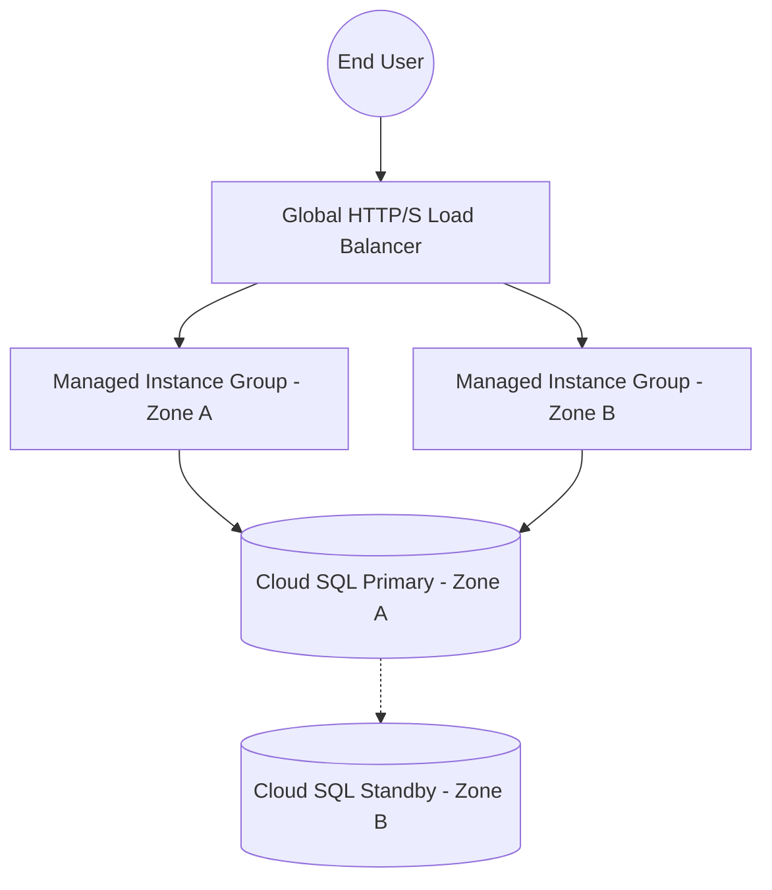

# Cloud Repository Build Pack: GCP-Highly-Available-WebApp

## 1. Repository Description
A robust, highly available 3-tier web application deployed on Google Cloud Platform using Managed Instance Groups (MIGs), Cloud SQL, and HTTP(S) Load Balancing. This project demonstrates enterprise-grade infrastructure designed for fault tolerance and auto-scaling.

## 2. Repository Topics / Tags
`gcp`, `cloud-architecture`, `load-balancing`, `auto-scaling`, `cloud-sql`, `high-availability`, `infrastructure-as-code`

## 3. Production README.md
```markdown
# Highly Available Web App on GCP

## Overview
This repository contains the architecture and deployment configurations for a Highly Available (HA) Web Application on Google Cloud Platform. The infrastructure leverages Regional Managed Instance Groups, Cloud SQL for PostgreSQL (HA setup), and a Global HTTP(S) Load Balancer to achieve zero-downtime scaling and fault tolerance across multiple zones.

## Architecture Highlights
- **Global Traffic Routing:** HTTP(S) Load Balancing with Google-managed SSL certificates.
- **Auto-Scaling:** CPU-based auto-scaling scaling out across `us-central1-a` and `us-central1-b`.
- **Database High Availability:** Cloud SQL PostgreSQL instance configured with a failover replica.
- **Security:** Private Google Access enabled, database traffic isolated to internal IPs.

## Deployment Instructions
Please refer to the implementation steps detailed below to replicate this environment.
```

## 4. Mermaid Architecture Diagram


## 5. Folder Structure
```
/GCP-Highly-Available-WebApp
├── README.md
├── architecture-diagram.png
├── src/
│   ├── app.py
│   └── requirements.txt
└── infra/
    ├── startup-script.sh
    └── ddl.sql
```

## 6. Screenshot Checklist
- [ ] Load Balancer frontend configuration showing healthy backends.
- [ ] Managed Instance Group dashboard showing instances active in multiple zones.
- [ ] Cloud SQL instance details showing HA enabled.
- [ ] Auto-scaling metrics during a simulated stress test.

## 7. Implementation Steps
1. **Network Setup:** Create a Custom VPC with a subnet in `us-central1`. Enable Private Google Access.
2. **Database Provisioning:** Deploy Cloud SQL PostgreSQL in HA mode. Configure private IP.
3. **Instance Template:** Create a Compute Engine instance template specifying the `startup-script.sh`.
4. **MIG Setup:** Create a Regional Managed Instance Group using the template. Set auto-scaling policy (target CPU 60%).
5. **Load Balancer:** Set up an HTTP(S) Load Balancer pointing to the MIG backend service. Configure health checks.

## 8. Skills Demonstrated
- Compute Engine, Managed Instance Groups (MIGs)
- HTTP(S) Load Balancing, SSL/TLS
- Cloud SQL (PostgreSQL), High Availability
- VPC, Private IP Networking

## 9. Resume Bullet Points
- Architected a highly available 3-tier web application on Google Cloud using Regional Managed Instance Groups and Global HTTP(S) Load Balancing, ensuring 99.99% uptime and fault tolerance.
- Configured Cloud SQL for PostgreSQL with high availability and automated failover, securing database traffic entirely within the private VPC.

## 10. Interview Talking Points
- **Why Regional over Zonal MIGs?** To protect against a single-zone failure. If `us-central1-a` goes down, the load balancer automatically routes to `us-central1-b`.
- **How does the Load Balancer know the instances are healthy?** Configured a health check on port 80. Unhealthy instances are drained and recreated by the MIG.
- **Database Security:** Cloud SQL uses only private IP addresses; no public IP is exposed to the internet.

## 11. Repository Creation Checklist
- [ ] Create GitHub Repository.
- [ ] Upload source files and scripts.
- [ ] Generate and upload `architecture-diagram.png` using Mermaid.
- [ ] Add the Production README.
- [ ] Add topics/tags to the repository.

## 12. Starter File Contents

### `infra/startup-script.sh`
```bash
#!/bin/bash
# Install dependencies
apt-get update
apt-get install -y python3-pip python3-venv git nginx

# Set up app directory
mkdir -p /opt/app
cd /opt/app

# Clone repo (placeholder)
# git clone <YOUR_REPO_URL> .

# Setup Python environment
python3 -m venv venv
source venv/bin/activate
pip install Flask gunicorn psycopg2-binary

# Start Gunicorn server binding to localhost:5000
nohup gunicorn --bind 127.0.0.1:5000 app:app &

# Configure Nginx as reverse proxy
cat <<EOF > /etc/nginx/sites-available/default
server {
    listen 80;
    location / {
        proxy_pass http://127.0.0.1:5000;
        proxy_set_header Host \$host;
        proxy_set_header X-Real-IP \$remote_addr;
    }
}
EOF

# Restart Nginx
systemctl restart nginx
```

### `infra/ddl.sql`
```sql
CREATE DATABASE webapp_db;

\c webapp_db;

CREATE TABLE users (
    id SERIAL PRIMARY KEY,
    username VARCHAR(50) UNIQUE NOT NULL,
    created_at TIMESTAMP DEFAULT CURRENT_TIMESTAMP
);

INSERT INTO users (username) VALUES ('admin'), ('guest');
```
