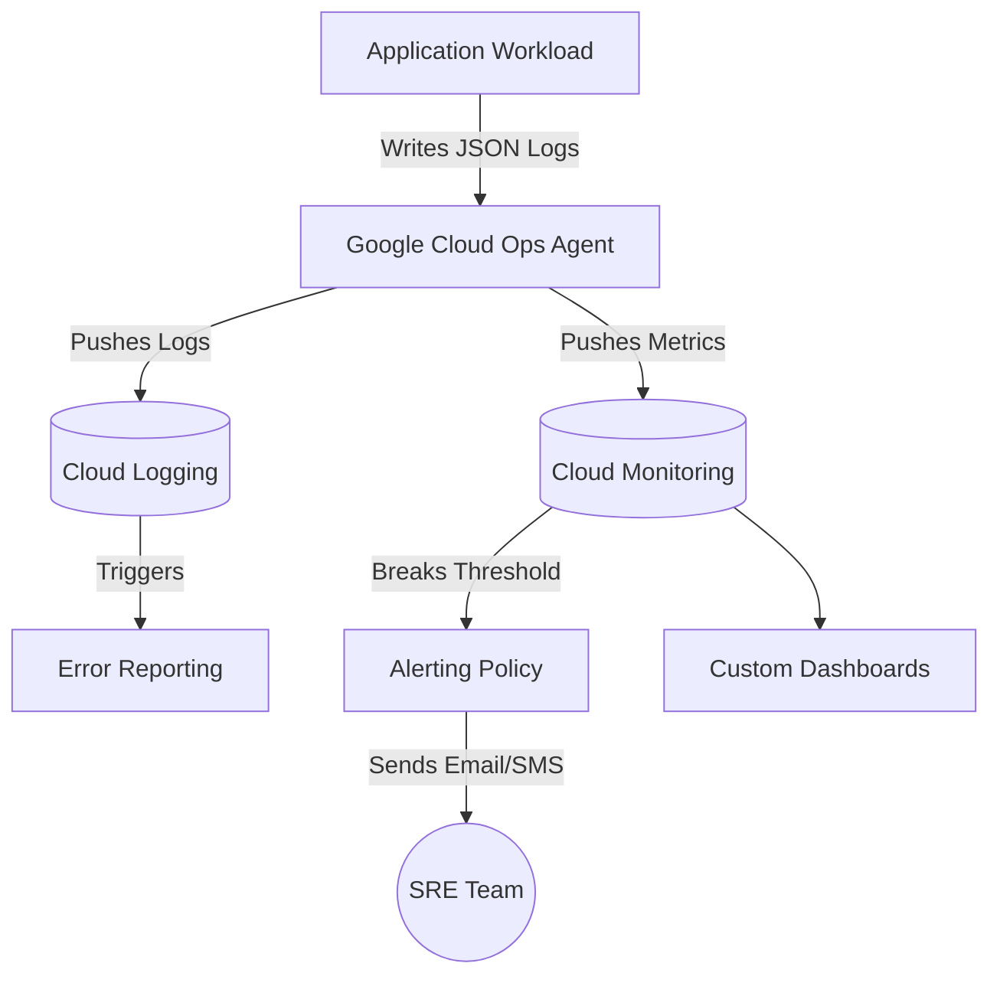

# Cloud Repository Build Pack: GCP-Observability-Monitoring

## 1. Repository Description
A comprehensive cloud observability implementation using Google Cloud Logging, Monitoring, and Error Reporting. This repository demonstrates how to instrument applications with custom metrics, set up automated alerting policies, and build custom dashboards to visualize system health.

## 2. Repository Topics / Tags
`gcp`, `observability`, `monitoring`, `cloud-logging`, `alerting`, `sre`, `devops`

## 3. Production README.md
```markdown
# Cloud Observability & Monitoring on GCP

## Overview
This repository showcases Site Reliability Engineering (SRE) practices implemented on Google Cloud Platform. It includes configurations for capturing structured application logs, exporting custom metrics via the Google Cloud Ops Agent, and setting up alerting policies using Terraform/JSON payloads.

## Architecture Highlights
- **Structured Logging:** Application logs formatted in JSON to enable advanced querying in Cloud Logging.
- **Custom Metrics:** Exporting business-specific metrics (e.g., `checkout_failures_per_minute`) to Cloud Monitoring.
- **Alerting & Dashboards:** Automated Alert Policies linked to PagerDuty/Email, alongside custom visualization dashboards.

## Deployment Instructions
Refer to the implementation steps to configure the Ops Agent on your VM/GKE cluster and import the dashboard and alerting JSON definitions.
```

## 4. Mermaid Architecture Diagram


## 5. Folder Structure
```
/GCP-Observability-Monitoring
├── README.md
├── architecture-diagram.png
├── monitoring/
│   ├── custom-dashboard.json
│   └── cpu-alert-policy.json
└── src/
    └── instrumented-app.py
```

## 6. Screenshot Checklist
- [ ] Cloud Logging Logs Explorer showing parsed JSON structured logs.
- [ ] Custom Monitoring Dashboard visualizing CPU, Memory, and Custom Metrics.
- [ ] Email screenshot of an alert notification being triggered.
- [ ] Error Reporting dashboard grouping a stack trace.

## 7. Implementation Steps
1. **Instrument Application:** Modify the application code (`instrumented-app.py`) to output structured JSON logs to `stdout`.
2. **Install Ops Agent:** Install the Google Cloud Ops Agent on the host Compute Engine VM.
3. **Log-Based Metrics:** Create a Log-Based Metric in Cloud Logging that counts occurrences of "ERROR" severity logs.
4. **Create Dashboard:** Import the `custom-dashboard.json` into Cloud Monitoring to create a visualization of the new metric.
5. **Set up Alerting:** Import the `cpu-alert-policy.json` to trigger an email notification when CPU exceeds 85% for 3 minutes.

## 8. Skills Demonstrated
- Cloud Monitoring (Dashboards, Metrics Explorer)
- Cloud Logging (Structured Logging, Log-based Metrics)
- Alerting Policies & Error Reporting
- Site Reliability Engineering (SRE) Fundamentals

## 9. Resume Bullet Points
- Implemented comprehensive cloud observability using Google Cloud Operations Suite, creating custom dashboards and log-based metrics to track application health.
- Configured automated alerting policies for critical infrastructure thresholds, reducing Mean Time to Detect (MTTD) by ensuring rapid notification of anomalies.

## 10. Interview Talking Points
- **Structured vs Unstructured Logs:** Why output JSON? Because Cloud Logging parses JSON keys automatically, allowing us to query logs easily (e.g., `jsonPayload.user_id = 12345`).
- **Log-Based Metrics:** We can extract metrics without modifying the app by creating a log-based metric that triggers every time a specific log string appears.
- **SRE Mindset:** Observability isn't just about graphs; it's about setting actionable alerts so humans don't have to watch the graphs.

## 11. Repository Creation Checklist
- [ ] Create GitHub Repository.
- [ ] Upload monitoring JSON files and app script.
- [ ] Generate and upload `architecture-diagram.png`.
- [ ] Add the Production README.

## 12. Starter File Contents

### `src/instrumented-app.py`
```python
import json
import logging
import sys
import time

# Configure structured JSON logging
logger = logging.getLogger('my-app')
logger.setLevel(logging.INFO)
handler = logging.StreamHandler(sys.stdout)

class JSONFormatter(logging.Formatter):
    def format(self, record):
        log_entry = {
            "severity": record.levelname,
            "message": record.getMessage(),
            "logger": record.name
        }
        return json.dumps(log_entry)

handler.setFormatter(JSONFormatter())
logger.addHandler(handler)

# Simulate Application
if __name__ == "__main__":
    while True:
        logger.info("Application is running normally.")
        time.sleep(2)
        logger.error("Simulated database connection timeout!")
        time.sleep(5)
```

### `monitoring/cpu-alert-policy.json`
```json
{
  "displayName": "High CPU Alert",
  "combiner": "OR",
  "conditions": [
    {
      "displayName": "CPU Usage > 85%",
      "conditionThreshold": {
        "filter": "metric.type=\"compute.googleapis.com/instance/cpu/utilization\" AND resource.type=\"gce_instance\"",
        "comparison": "COMPARISON_GT",
        "thresholdValue": 0.85,
        "duration": "180s",
        "trigger": {
          "count": 1
        }
      }
    }
  ]
}
```
