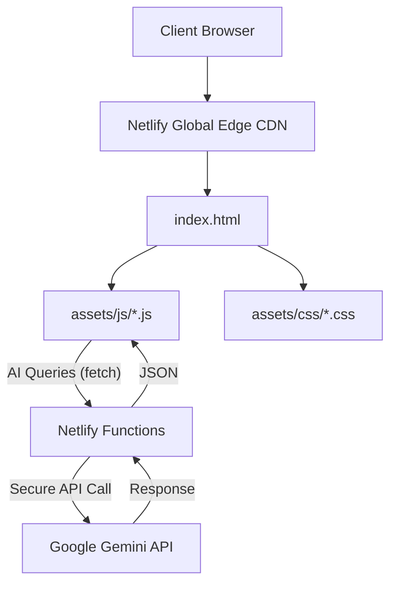

# System Architecture

This document provides a technical deep-dive into how the `rajathkiran.io` repository is architected, covering frontend organization, styling strategy, AI integration, and deployment.

---

## High-Level Architecture

The project follows a **"Vanilla + Serverless"** architecture. It deliberately avoids heavy SPA frameworks (like React or Next.js) for the main UI to guarantee sub-second load times and a zero-dependency client environment. Complex functionality (like the AI Chat) is offloaded to Netlify Edge/Serverless functions.



---

## Frontend Architecture

The single-page application structure is built on a custom Vanilla JS router that intercepts navigation clicks and manipulates DOM visibility.

### Logic Layers (`assets/js/`)
1. **`script.js`**: The core controller. Handles page routing, element toggling, sidebar mechanics, modal system, and contact form validation.
2. **`os-intelligence.js`**: The "power user" layer. Adds keyboard shortcuts, Recruiter Mode toggles, Environment Switcher logic, and the Hacker Terminal logic.
3. **`three-background.js`**: The graphics engine. Initializes WebGL contexts and handles particle animation loops.
4. **`ai-chat.js`**: The conversational AI UI handler. Dynamically loaded to prevent render-blocking.

---

## CSS Architecture (`assets/css/`)

Styling relies entirely on native CSS Custom Properties (Variables) to enable rapid theming and a single source of truth for design tokens.

- **`style.css`**: The monolithic core stylesheet. Contains reset rules, typography scale, color tokens, and layout styles for all main articles.
- **`os-intelligence.css`**: Supplemental stylesheet for dynamic components like the OS Dock, Recruiter Mode indicators, AI Chat UI, and the Hacker Terminal.

### Theming Strategy
```css
:root {
  /* Color Palette */
  --bg-gradient-onyx: linear-gradient(...);
  --bg-gradient-jet: linear-gradient(...);
  --neon-blue: #00d8ff;
  
  /* Typography */
  --fs-1: 24px;
  --fs-2: 18px;
}
```

---

## AI Chat Flow Architecture

The AI Chat Assistant uses an agentic RAG (Retrieval-Augmented Generation) approach, but hardcoded into the serverless layer for security and speed.

1. **User Input**: User types a question in the `#ai-chat-panel`.
2. **Client Request**: `ai-chat.js` sends a POST request to `/.netlify/functions/ask-rajath`.
3. **Serverless Orchestration**: `ask-rajath.js` receives the prompt. It prepends a massive, hidden "System Prompt" containing Rajath's entire resume, availability, and personality traits.
4. **LLM Generation**: The combined prompt is sent to `gemini-1.5-flash`.
5. **Response Delivery**: The response is streamed/returned to the client and rendered in the UI with a typing effect.

---

## SEO & Performance Architecture

### Programmatic SEO
Instead of keeping all data locked inside the SPA, dedicated physical HTML pages (`ayudost.html`, `copd-detection.html`, etc.) are generated. This ensures web crawlers can index deep content without executing JavaScript.

### Core Web Vitals Optimization
- **LCP (Largest Contentful Paint)**: Main avatar image is preloaded and set to `loading="eager"`.
- **CLS (Cumulative Layout Shift)**: All `` tags have explicit `width` and `height` attributes.
- **INP (Interaction to Next Paint)**: Scroll events are wrapped in `requestAnimationFrame` and set to `{ passive: true }`.

---

## Deployment Architecture

The application relies on Netlify's CI/CD pipeline.

- **Trigger**: Every push to `main` triggers a build.
- **Build Step**: (None required for the static assets).
- **Functions**: Netlify automatically detects the `netlify/functions` directory and deploys them as AWS Lambda functions under the hood.
- **Serving**: Assets are globally distributed via Netlify's Edge network.
